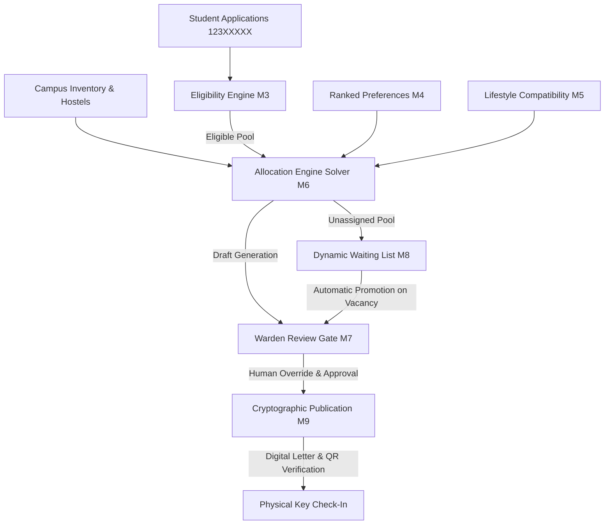
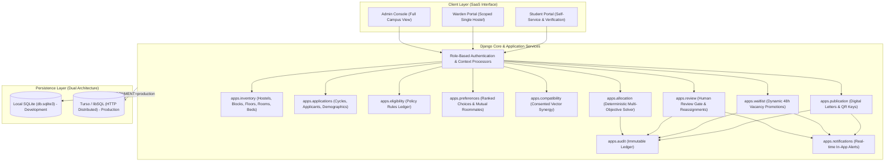
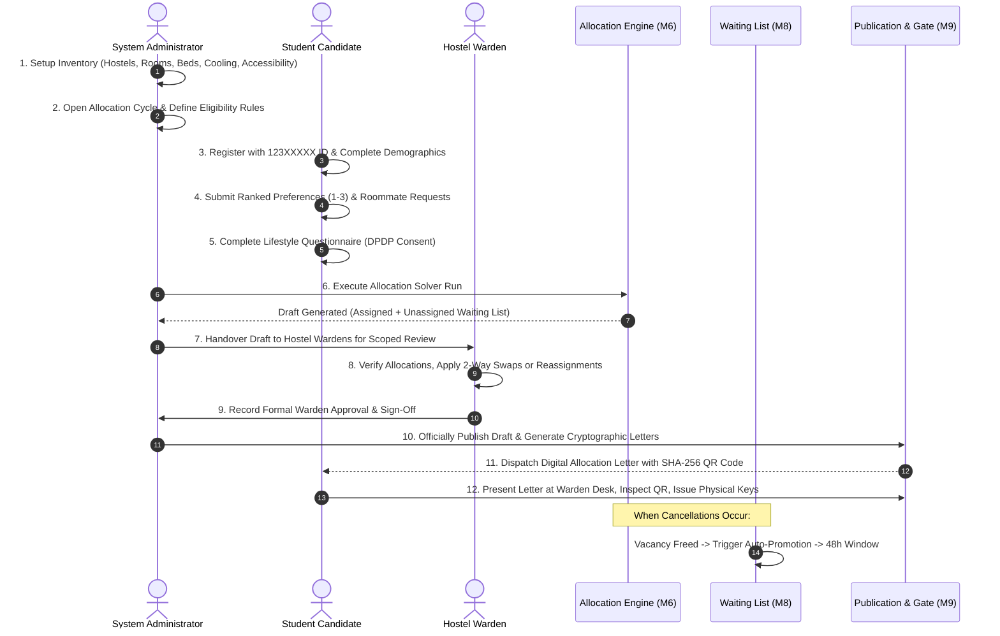
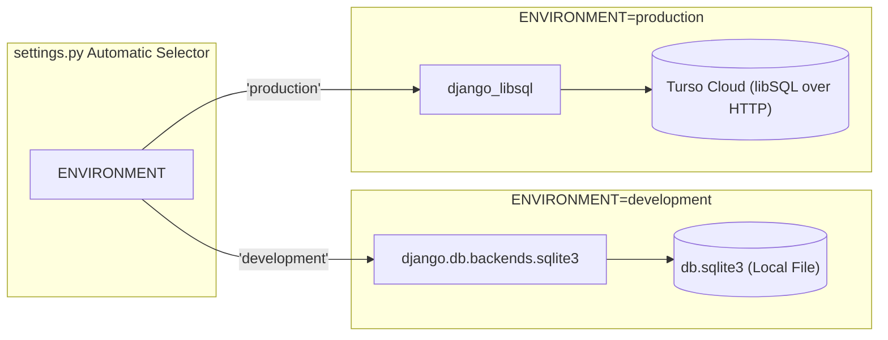
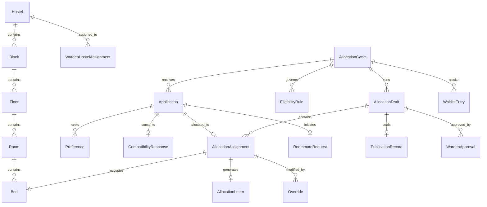
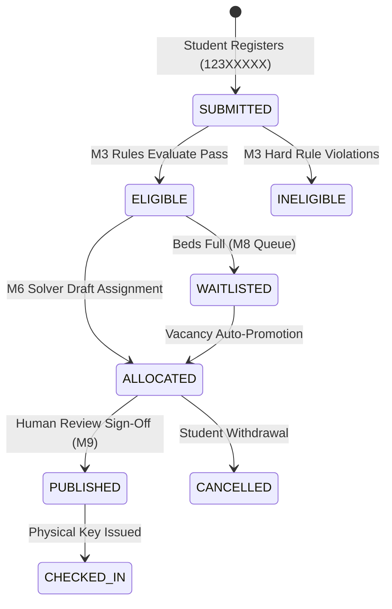
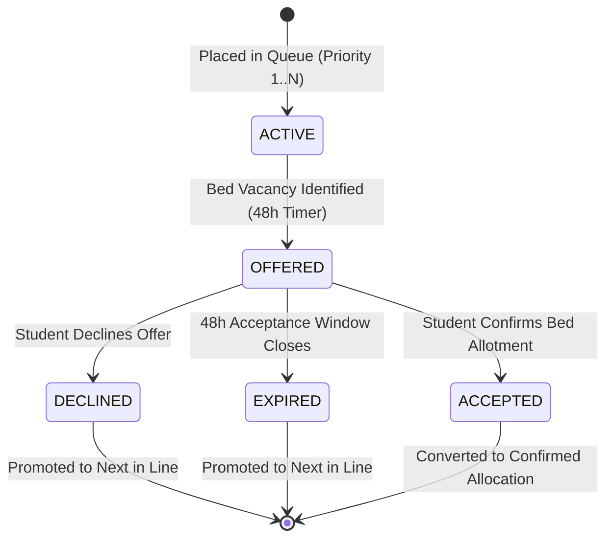

# Policy-Driven Hostel Allocation Engine (P03 Specification v2.0)
## System Architecture & Complete Workflow Guide

---

## 1. Executive Summary & Core Mission

The **Policy-Driven Hostel Allocation Engine** is an enterprise-grade academic residential management platform designed to solve the complex logistical, ethical, and regulatory challenges of higher-education campus housing.

Traditional hostel allotment suffers from manual spreadsheets, non-transparent waiting lists, lack of auditability, roommate lifestyle mismatches, and gender policy violations. This engine replaces ad-hoc assignments with a **deterministic, policy-governed mathematical allocation engine** backed by human-in-the-loop governance gates, cryptographic verification, DPDP Act 2023 privacy safeguards, and a dual-database cloud architecture.



---

## 2. High-Level System Architecture

The application is structured into decoupled, domain-driven Django apps running on top of an environment-driven persistence layer:



---

## 3. End-to-End Operational Lifecycle Workflow

The lifecycle flows through 9 distinct operational phases from initial campus setup to student physical check-in:



---

## 4. Detailed Module Architecture & Mechanics

### Module 1: Campus Inventory Engine (`apps.inventory`)
* **Hierarchical Structure**: `Hostel` $\rightarrow$ `Block` $\rightarrow$ `Floor` $\rightarrow$ `Room` $\rightarrow$ `Bed`.
* **Multi-Capacity Rooms**:
  * Single Occupancy (`SINGLE`)
  * Double Sharing (`DOUBLE`)
  * Triple Sharing (`TRIPLE`)
  * Dormitory 4+ (`DORM`)
* **Cooling Infrastructure**:
  * Central / Split Air Conditioning (`AC`)
  * Desert / Evaporative Cooler (`COOLER`)
  * Natural Ventilation / Ceiling Fan (`NONE`)
* **Ground-Floor Accessibility**: Rooms and beds marked `is_accessible=True` are physically equipped with wheelchair ramps, roll-in bathrooms, and wide doorways, strictly reserved for candidates with documented accessibility requirements.
* **Interactive Bed Map**: Visual color-coded matrix displaying real-time bed states (`AVAILABLE`, `OCCUPIED`, `MAINTENANCE`, `RESERVED`).

---

### Module 2: Intake Cycles & Candidate Applications (`apps.applications`)
* **Academic Cycles**: Time-boxed intake periods (e.g. `AY2026-AUTUMN`) with strict open and close dates.
* **Student Identifier Validation**: Strict format enforcement requiring 8 digits starting with `123` (`123XXXXX`, e.g., `12300001`, `12300030`).
* **Demographic & Merit Data**: Tracks verified distance from home campus (km), academic CGPA (0.00 to 10.00), disciplinary history, and fee clearance status.

---

### Module 3: Policy-Driven Eligibility Ledger (`apps.eligibility`)
* **Configurable Rule Types**:
  * `DISTANCE`: Minimum travel distance threshold (e.g., $\ge 30\text{ km}$).
  * `ACADEMIC`: Minimum CGPA merit cutoff (e.g., $\ge 6.0$).
  * `DISCIPLINARY`: Maximum disciplinary demerit points allowed ($= 0$).
  * `FEE_CLEARED`: Verified tuition and residential dues clearance.
* **Hard vs. Soft Constraints**: Hard rules strictly disqualify non-compliant applicants; soft rules feed tie-breaking priority scores.
* **Batch Verification Engine**: Evaluates hundreds of candidates in sub-second execution with detailed pass/fail audit logs.

---

### Module 4: Student Preferences & Roommate Pairing (`apps.preferences`)
* **Ranked Choices**: Students submit Rank #1 (Weight: 100%), Rank #2 (Weight: 60%), and Rank #3 (Weight: 30%) selections of preferred hostel, room type, and cooling.
* **Mutual Roommate Verification**:
  * Candidate A requests Candidate B ($A \rightarrow B$).
  * Only when Candidate B reciprocal-requests Candidate A ($B \rightarrow A$) does the pair become **`MUTUAL_CONFIRMED`**.
  * Mutual pairs receive atomic co-allocation into the same room.
* **Gender Policy Isolation**: Preference dropdowns strictly filter and prevent female applicants from selecting male hostels and vice-versa.

---

### Module 5: Consented Lifestyle Compatibility Engine (`apps.compatibility`)
* **DPDP Act 2023 Compliance**: Explicit consent is required before processing personal lifestyle habits. Non-consenting students are assigned without personality evaluation.
* **Vectorized Scoring Dimensions**:
  $$\text{Synergy Score} = 0.40 \cdot S_{\text{sleep}} + 0.30 \cdot S_{\text{study}} + 0.20 \cdot S_{\text{clean}} + 0.10 \cdot S_{\text{guest}}$$
  1. **Sleep Schedule (40%)**: Early Bird ($<11\text{ PM}$), Flexible, Night Owl ($>1\text{ AM}$).
  2. **Study Environment (30%)**: Absolute Silence, Ambient / Music, Collaborative.
  3. **Cleanliness Standard (20%)**: High/Spic-and-Span, Moderate, Relaxed.
  4. **Guest Boundaries (10%)**: Strict privacy ($1$) to social hub ($5$).
* **Pairwise Compatibility Sandbox**: Wardens and admins can simulate any two applicants to preview lifestyle harmony and potential room friction.

---

### Module 6: Deterministic Multi-Objective Allocation Solver (`apps.allocation`)
* **Mathematical Optimization**: Formulated as a constrained multi-criteria matching problem:
  * **Objective**: Maximize preference rank satisfaction $+$ mutual roommate co-locations $+$ lifestyle compatibility synergy.
  * **Hard Constraints**:
    1. Gender isolation (no cross-gender assignments).
    2. Capacity limits (no room over-allocation).
    3. Accessibility priority (wheelchair applicants guaranteed accessible beds).
    4. Room sharing limits.
* **What-If Simulation Sandbox**: Admins can run trial drafts with varying parameters (e.g. changing distance weight from 50% to 70%) to compare satisfaction metrics before committing.

---

### Module 7: Warden Review Gate & Human Override (`apps.review`)
* **Jurisdictional Locking**: Wardens assigned to Hostel A cannot see or modify assignments in Hostel B.
* **Two-Way Resident Swap**:
  * Atomically swaps two students across rooms while enforcing gender and accessibility constraints.
  * Prevents `UniqueConstraint` collisions using two-phase transactional swap logic.
* **Vacant Bed Reassignments**: Reassigns a student from one bed to an unoccupied bed within the warden's hostel.
* **Mandatory Justification**: No override can be committed without a non-empty audit reason.

---

### Module 8: Dynamic Waiting List & Promotion Engine (`apps.waitlist`)
* **Gapless Priority Indexing**: Active candidates maintain sequential queue ranks ($1, 2, 3\dots$) without gaps.
* **Event-Driven Auto-Promotion**:
  * Triggered whenever an allocated student cancels, declines, or their offer expires.
  * Automatically scans for the highest-priority eligible candidate of the matching gender and accessibility tier.
  * Dispatches a time-boxed 48-hour bed offer.
* **Manual Bed Offer Modal**: Scoped dropdowns display only vacant beds compliant with the student's gender policy.

---

### Module 9: Cryptographic Publication & Key Issuance Gate (`apps.publication`)
* **Immutable Digital Letters**: Once a draft is sealed and published, letters are stamped with a unique document reference (e.g. `AL-AY2026-AUTUMN-BH-4-12300001`).
* **Cryptographic QR Code**: Generated via SHA-256 hash of document reference and assignment ID (`hashlib.sha256(ref:id).hexdigest()[:16]`).
* **Desk Check-In & Key Issuance**: Front desk staff scan the student's letter, verify the QR authenticity, enter the physical brass key number, and mark the student officially checked in.

---

## 5. Dual Database Architecture (SQLite vs. Turso libSQL)

The engine supports seamless multi-cloud persistence without changing business code:



* **Local Development**: Uses standard `db.sqlite3` with zero network latency and no cloud dependencies.
* **Production Deployment**: Uses `django-libsql-backend` connected to Turso via `TURSO_DATABASE_URL` and `TURSO_AUTH_TOKEN`.
* **Zero-Leakage**: Secrets remain strictly within environment variables and `.env` (ignored by Git).
* **Auto-Seed on Fresh DB**: If the connected database (SQLite or Turso) is empty, `post_migrate` signals and `AutoSeedMiddleware` automatically seed full P03 demonstrator data.

---

## 6. Entity Relationship Diagram (ERD)



---

## 7. State Machine Transitions

### Candidate Application State Machine


### Waiting List Entry State Machine


---

## 8. Directory & Service Layout

```
rpl/
├── apps/
│   ├── allocation/        # M6 Multi-Objective Solver & What-If Simulations
│   ├── applications/      # M2 Intake Cycles & Candidate Profile Management
│   ├── audit/             # Cross-cutting Immutable Action Audit Ledger
│   ├── compatibility/     # M5 Consented DPDP Act Lifestyle Compatibility Engine
│   ├── core/              # SaaS Authentication, Dashboard, Middleware, Auto-Seed
│   ├── eligibility/       # M3 Configurable Policy Rules & Clearance Engine
│   ├── inventory/         # M1 Campus Hostels, Blocks, Rooms, Beds & Bed Map
│   ├── notifications/     # Real-time In-App Notification Center
│   ├── preferences/       # M4 Ranked Preferences & Mutual Roommate Requests
│   ├── publication/       # M9 Sealed Digital Letters, QR Keys & Check-In
│   ├── review/            # M7 Warden Scoped Review Gate & Reassignment Overrides
│   └── waitlist/          # M8 Gapless Waiting List & 48h Vacancy Auto-Promotions
├── config/
│   ├── settings/
│   │   ├── __init__.py    # Dynamic environment-driven settings dispatcher
│   │   ├── base.py        # Core apps, middleware, DB switch, and tokens
│   │   ├── dev.py         # Local development overrides
│   │   └── prod.py        # Production security, SSL headers, and cache fallback
│   ├── urls.py            # Global URL routing
│   └── wsgi.py            # Production WSGI application
├── static/                # Vanilla CSS, SVG icons, and frontend assets
├── templates/             # Semantic HTML5 + TailwindCSS + Alpine.js templates
├── docker-entrypoint.sh   # Container bootstrap: migrations, static, auto-seed
├── Dockerfile             # Multi-stage production container definition
├── docker-compose.yml     # Container orchestration with Redis and Web services
├── requirements.txt       # Production dependencies entrypoint
└── requirements/          # Modular requirements (base, dev, prod)
```
