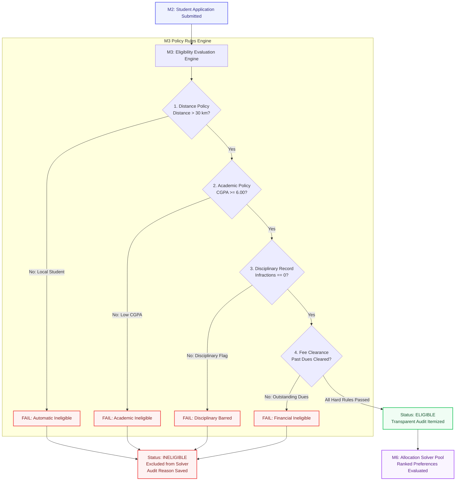

# M3 · Eligibility Module — Architecture & Implementation Roadmap

> **Document Version:** `2.0-STABLE`  
> **Target Module:** `apps/eligibility` (Policy Rules Evaluation Engine)  
> **Upstream Dependency:** `apps/applications` (M2 Intake)  
> **Downstream Consumer:** `apps/allocation` (M6 Solver Heuristic)  
> **Governance Standard:** P03 Specification · Deterministic Institutional Policy Enforcement  

---

## 📑 Executive Summary

The **M3 Eligibility Module** serves as the authoritative, tamper-proof **Gatekeeper** between student application intake (M2) and the combinatorial room allocation solver (M6). 

In institutional hostel administration, hostel beds are a scarce resource. Therefore, not every applicant qualifies for room assignment. The Eligibility Engine deterministically evaluates each student against configurable institutional policy rules (distance from campus, minimum academic CGPA, disciplinary clearances, and fee settlement) before any student can enter the allocation solver pool.



---

## 🏛️ Policy Rule Architecture & Data Schema

The system supports both **Hard Rules** (mandatory institutional bars) and **Soft Rules** (preference or scoring weights).

### The 4 Core Rule Types

| Rule Type | Scope & Rule Target | Default Hard Parameter | Failure Consequence | Audit Output Example |
| :--- | :--- | :--- | :--- | :--- |
| **`DISTANCE`** | Distance of applicant's permanent home from campus | `min_distance_km: 30` | Automatic Ineligibility | `"Failed: Distance is 18 km (threshold > 30 km required for residency)."` |
| **`ACADEMIC`** | Minimum CGPA or academic performance index | `min_cgpa: 6.0` | Automatic Ineligibility | `"Passed: CGPA 8.4 satisfies institutional academic threshold (>= 6.0)."` |
| **`DISCIPLINARY`** | University Proctorial Board disciplinary infractions | `max_infractions: 0` | Automatic Disqualification | `"Passed: Clean disciplinary record (0 active infractions recorded)."` |
| **`FEE_CLEARED`** | Prior semester tuition and mess fee clearance | `require_clearance: true` | Hold / Ineligibility | `"Passed: Financial accounts verified zero prior arrears."` |

---

## 🔍 Codebase Audit: Current State vs. Missing Elements

### 1. What Currently Exists in Code

- **Data Models (`apps/eligibility/models.py`)**:
  - `EligibilityRule`: Stores rule name, cycle foreign key, rule type choice, parameters JSON (`{'min_distance_km': 30}`), and `is_hard_rule` boolean flag.
  - `EligibilityResult`: Stores atomic evaluation record (`application`, `rule`, `is_passed`, `reason`).
- **Policy Rules List View (`apps/eligibility/views.py`)**:
  - Renders read-only rule definition cards at `http://localhost:8000/eligibility/rules/`.
- **Service Stub (`apps/eligibility/services.py`)**:
  - Contains function skeleton `evaluate_application()`, but hardcodes `passed = True` without evaluating real application parameters.

### 2. What Is Currently Missing (Gap Analysis)

```
┌──────────────────────────────────────┬─────────────┬────────────────────────────────────────────────────────┐
│ Component                            │ Current     │ Target Architecture Requirement                        │
├──────────────────────────────────────┼─────────────┼────────────────────────────────────────────────────────┤
│ 1. Dynamic Evaluation Logic          │ Stub (Dummy)│ Real mathematical checks for distance, CGPA & proctor  │
│ 2. Batch Evaluation Action Button    │ Missing     │ Warden/Admin 1-click evaluation trigger on web portal  │
│ 3. Policy Execution Metrics Bar      │ Missing     │ Total Evaluated, Qualified Eligible, Disqualified Count│
│ 4. Student Transparency Checklist    │ Static Text │ Itemized checklist with green checkmarks & red crosses │
│ 5. Rule Parameter Editing Modal      │ None        │ Admin modal to customize thresholds (e.g. 30 -> 40km)  │
│ 6. Solver Integration Integrity      │ Partial     │ M6 Solver strictly rejecting non-eligible records      │
└──────────────────────────────────────┴─────────────┴────────────────────────────────────────────────────────┘
```

---

## 🛠️ Step-by-Step Implementation Roadmap

---

### 🔹 Phase 1: Real Rule Evaluation Engine (Backend Core)
**Target File:** [`apps/eligibility/services.py`](file:///c:/Users/ASUS/OneDrive/Desktop/rpl/apps/eligibility/services.py)

#### Detailed Logic Flow:
1. **Distance Rule Calculation:**
   ```python
   # Check real student distance
   min_dist = rule.parameters.get("min_distance_km", 30)
   student_dist = application.distance_from_campus_km or 0
   if student_dist < min_dist:
       passed = False
       reason = f"Distance from campus is {student_dist} km, which is below the mandatory residency threshold of {min_dist} km."
   else:
       passed = True
       reason = f"Resides {student_dist} km from campus, satisfying institutional distance requirement (>= {min_dist} km)."
   ```
2. **Academic CGPA Rule Calculation:**
   ```python
   min_cgpa = rule.parameters.get("min_cgpa", 6.0)
   student_cgpa = application.cgpa or 0.0
   if student_cgpa < min_cgpa:
       passed = False
       reason = f"CGPA of {student_cgpa} fails minimum academic requirement of {min_cgpa}."
   else:
       passed = True
       reason = f"CGPA of {student_cgpa} satisfies academic standing threshold (>= {min_cgpa})."
   ```
3. **Disciplinary & Status Update:**
   - Evaluates infraction count.
   - If any **Hard Rule** fails (`rule.is_hard_rule == True`), marks `application.status = "INELIGIBLE"`.
   - If all Hard Rules pass, marks `application.status = "ELIGIBLE"`.
   - Writes atomic transaction log to `AuditEntry`.

---

### 🔹 Phase 2: Warden & Admin Batch Policy Console (UI Action)
**Target File:** [`templates/eligibility/rules.html`](file:///c:/Users/ASUS/OneDrive/Desktop/rpl/templates/eligibility/rules.html)  
**Target View:** [`apps/eligibility/views.py`](file:///c:/Users/ASUS/OneDrive/Desktop/rpl/apps/eligibility/views.py)

#### Features to Implement:
1. **Top Performance Metrics Cards:**
   - **Total Intake Applications:** (e.g. 64)
   - **Institutional Qualified (`ELIGIBLE`):** (e.g. 58 students)
   - **Policy Disqualified (`INELIGIBLE`):** (e.g. 6 students)
2. **"Run Batch Eligibility Check" Button:**
   - Primary action button for Wardens/Admins.
   - Evaluates all `SUBMITTED` applications in the active cycle and generates `EligibilityResult` items.
3. **Interactive Results Table:**
   - Columns: Student Name, Roll No., Degree, Distance (km), CGPA, Eligibility Status (`ELIGIBLE` vs `INELIGIBLE`), Details / Reason popover.
   - Filter pills: *Show All / Eligible Only / Ineligible Only*.

---

### 🔹 Phase 3: Student Transparency Card ("Am I Eligible?")
**Target File:** [`templates/applications/detail.html`](file:///c:/Users/ASUS/OneDrive/Desktop/rpl/templates/applications/detail.html) & [`templates/allocation/explanation.html`](file:///c:/Users/ASUS/OneDrive/Desktop/rpl/templates/allocation/explanation.html)

#### Visual Experience:
- Students can see an itemized transparency checklist under **Factor #1: Institutional Eligibility Verification**:
  - [x] **Distance Threshold:** `185 km from campus (> 30 km required) — PASSED`
  - [x] **Academic Standing:** `CGPA 8.42 (>= 6.00 required) — PASSED`
  - [x] **Disciplinary Clearance:** `0 Infractions on record — PASSED`
  - [x] **Fee Verification:** `Semester Dues Cleared — PASSED`

---

### 🔹 Phase 4: Integration with M6 Solver & M8 Waitlist
**Target File:** [`apps/allocation/services.py`](file:///c:/Users/ASUS/OneDrive/Desktop/rpl/apps/allocation/services.py)

#### Logic Lock:
- `AllocationService.run_allocation` enforces strict filtering:
  ```python
  # Only students who passed M3 eligibility are allowed into the solver
  eligible_apps = Application.objects.filter(cycle=cycle, status="ELIGIBLE")
  ```
- Local students (distance < 30km) or students disqualified under proctorial checks will **never** accidentally receive a hostel bed.

---

## 📋 Execution Plan Checklist

- [ ] **Step 1:** Implement dynamic parameter evaluation in `apps/eligibility/services.py`.
- [ ] **Step 2:** Add `run_batch_evaluations_view` in `apps/eligibility/views.py` and register route in `apps/eligibility/urls.py`.
- [ ] **Step 3:** Upgrade `templates/eligibility/rules.html` with stats cards, batch evaluation button, and results table.
- [ ] **Step 4:** Embed eligibility itemized results in student application detail view.
- [ ] **Step 5:** Seed sample applications with borderline distances (e.g. 15 km) to demonstrate pass/fail accuracy.
- [ ] **Step 6:** Run test suite and verify system check passes cleanly.
