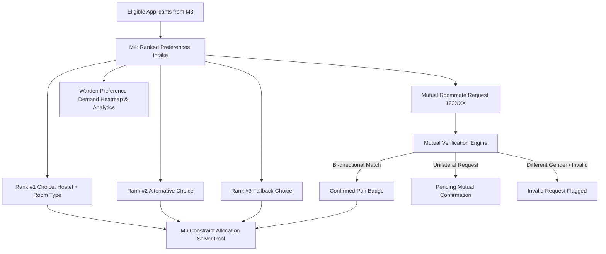

# M4 · Preferences Module Architectural Roadmap & Implementation Plan
**Hostel Allocation & Roommate Matching Engine (P03 Specification v2.0)**

---

## 1. Executive Summary & Objective

The **Preferences Module (M4)** empowers students to express their ranked residential choices while providing administrators with demand analytics and providing the **M6 Constraint Allocation Engine** with ranked preference tuples and verified mutual roommate clusters.



---

## 2. Core Capabilities & Feature Matrix

| Feature | Student Experience | Warden / Administrator Experience | Solver Impact (M6) |
| :--- | :--- | :--- | :--- |
| **Ranked Choices (1, 2, 3)** | Pick top 3 hostels & room sharing types (Single, Double, Triple, Dorm). | View demand distribution, oversubscribed hostels, room-type preference ratios. | Soft constraint: solver prioritizes Rank #1 (weight: 100%), Rank #2 (60%), Rank #3 (30%). |
| **Gender-Constrained Hostels** | Only shows hostels matching student gender (Prevents invalid male-to-women hostel choices). | Audits cross-hostel intake balance. | Zero hard constraint violations on gender separation. |
| **Mutual Roommate Verification** | Real-time status indicator: *Mutual Match Confirmed* vs *Pending Partner Confirmation*. | Table of confirmed mutual roommate pairs ready for co-allocation. | Co-assigns mutual pairs into the same double/dorm room when capacity allows. |
| **Demand Analytics Hub** | Live cards showing single-room demand vs inventory capacity. | Interactive charts/bars showing hostel popularity and room sharing split. | Informs waitlist strategy and capacity planning. |

---

## 3. Data Model Architecture

### `Preference` Entity (`apps.preferences.models.Preference`)

```python
class Preference(TenantModel):
    application = models.ForeignKey(Application, on_delete=models.CASCADE, related_name="preferences")
    rank = models.PositiveSmallIntegerField(help_text="1 = Highest preference, 2 = Alternative, 3 = Fallback")
    preferred_hostel = models.ForeignKey(Hostel, on_delete=models.CASCADE)
    preferred_room_type = models.CharField(
        max_length=20,
        choices=[
            ("SINGLE", "Single Occupancy"),
            ("DOUBLE", "Double Sharing"),
            ("TRIPLE", "Triple Sharing"),
            ("DORM", "Dormitory"),
        ],
        default="DOUBLE"
    )
    preferred_roommate_id = models.CharField(
        max_length=64, 
        blank=True, 
        null=True, 
        help_text="Registration number of requested roommate (e.g. 12300002)"
    )

    class Meta:
        ordering = ["rank"]
        unique_together = ("application", "rank")
```

---

## 4. Service Layer: `PreferenceService` API

The service layer in [`apps/preferences/services.py`](file:///c:/Users/ASUS/OneDrive/Desktop/rpl/apps/preferences/services.py) will provide:

1. **`get_ranked_preferences_for_application(app_id)`**:
   Returns the ordered list of preferences for a student with pre-fetched hostel metadata.
2. **`check_roommate_mutual_status(app)`**:
   Determines the status of a requested roommate:
   * **`MUTUAL_CONFIRMED`**: Both students have requested each other in their preferences and have identical gender.
   * **`PENDING_PARTNER`**: Student requested a valid candidate who has not yet submitted preferences or requested someone else.
   * **`INVALID_CANDIDATE`**: Target ID does not exist, belongs to another cycle, or has an incompatible gender.
   * **`NONE`**: No roommate requested.
3. **`get_confirmed_mutual_pairs(cycle_id)`**:
   Returns unique pairs `(student_a, student_b)` for batch co-allocation in M6.
4. **`get_demand_analytics(cycle_id)`**:
   Calculates demand counts per hostel and room sharing category.

---

## 5. UI/UX Enhancements for M4

1. **Gender Filtering in Submission Modal**:
   When a student opens the modal, only hostels matching their gender (`Hostel.gender_type == app.gender`) are displayed in the dropdowns.
2. **Live Mutual Badge in Preferences Table**:
   * Green Badge: `Mutual Roommate Confirmed (ID: 12300002)`
   * Amber Badge: `Roommate Request Pending Confirmation (ID: 12300002)`
3. **Confirmed Mutual Roommate Ledger Tab**:
   Dedicated view for wardens listing all confirmed paired students.
4. **Demand Analytics Bar Visuals**:
   Visual capacity indicators comparing requested beds vs total hostel capacity.

---

## 6. Implementation Action Plan

1. **Step 1:** Expand `PreferenceService` with mutual roommate detection and demand calculation algorithms.
2. **Step 2:** Update `preferences_list_view` to pass mutual statuses, gender-filtered hostels, and demand statistics to the template.
3. **Step 3:** Upgrade `templates/preferences/list.html` with mutual pairing badges, gender-aware modal inputs, and mutual pairs ledger tab.
4. **Step 4:** Enhance sample data seeding (`seed_sample_data.py`) with demonstrator mutual roommate pairs (e.g. Aarav & Rohan).
5. **Step 5:** Run automated test verification and verify browser rendering.
