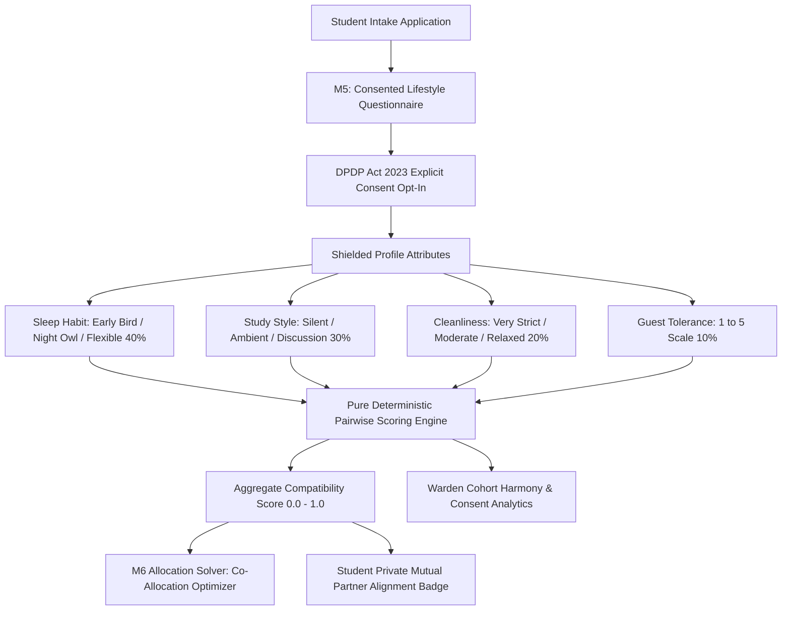

# M5 · Lifestyle Compatibility & Consent Protection Roadmap
**Hostel Allocation Engine · Specification v2.0 (DPDP Act 2023 Compliant)**

---

## 1. Executive Summary & Objective

The **Compatibility Module (M5)** ensures optimal student roommate pairings by evaluating lifestyle attributes (sleep habits, study environments, cleanliness standards, and guest tolerance) through a deterministic pairwise compatibility metric.

In strict adherence to the **Digital Personal Data Protection (DPDP) Act 2023**, raw individual survey answers are cryptographically shielded and **never exposed** to other students or wardens. Only aggregate compatibility percentages (0%–100%) are calculated in-memory and supplied to the **M6 Constraint Allocation Engine**.

---

## 2. Mathematical Pairwise Compatibility Formula

For any two applicants $A$ and $B$, their compatibility score $\mathcal{C}(A, B) \in [0.0, 1.0]$ is computed as:

$$\mathcal{C}(A, B) = w_{\text{sleep}} \cdot \mathcal{S}_{\text{sleep}} + w_{\text{study}} \cdot \mathcal{S}_{\text{study}} + w_{\text{clean}} \cdot \mathcal{S}_{\text{clean}} + w_{\text{guest}} \cdot \mathcal{S}_{\text{guest}}$$

### Dimensional Weights & Scoring Rules

| Dimension | Weight | Scoring Matrix |
| :--- | :--- | :--- |
| **Sleep Habits** | **40%** | Exact match: **1.0** · Flexible with any: **0.625** · Early Bird vs Night Owl clash: **0.0** |
| **Study Environment** | **30%** | Exact match: **1.0** · Light Music/Ambient with any: **0.667** · Silent vs Collaborative clash: **0.0** |
| **Cleanliness Priority** | **20%** | Exact match: **1.0** · Moderate with any: **0.60** · Strict vs Casual clash: **0.0** |
| **Guest Tolerance** | **10%** | Linear penalty based on absolute delta: $\max(0.0, 0.10 - 0.025 \cdot \|G_A - G_B\|)$ |

---

## 3. Feature Matrix Across Roles

| Capability | Student View | Warden View | System Administrator | M6 Allocation Solver |
| :--- | :--- | :--- | :--- | :--- |
| **Lifestyle Survey Intake** | Fill and update survey answers with DPDP Act 2023 consent checkbox. | Read-only cohort statistics; raw answers never revealed. | Full audit ledger of consent status and submission timestamps. | Feeds candidate profiles into pairwise cache. |
| **Partner Alignment Check** | If student specified a mutual roommate in M4, reveals their **aggregate match percentage** (e.g. 92% Compatible) without leaking answers. | Scoped view of mutual pair compatibility for assigned hostel. | Global compatibility matrix for all mutual roommate requests. | Prioritizes high-compatibility mutual pairs in double rooms. |
| **Cohort Harmony Analytics** | Hidden for peer privacy. | Distribution of sleep, study, and cleanliness metrics for residents opting for assigned hostel. | Campus-wide lifestyle affinity distributions and DPDP consent compliance percentage. | Balances roommate harmony across multi-occupancy rooms. |
| **Compatibility Sandbox** | Simulated hypothetical test tool. | Interactive pairwise compatibility tester between any two candidates in assigned hostel. | Campus-wide simulation sandbox to inspect compatibility before running solver. | Used directly in objective function: $\sum \mathcal{C}(i, j) \to \max$. |

---

## 4. Privacy & DPDP Act 2023 Protections

1. **Zero Raw Answer Leakage**: A student can **never** see whether their roommate answered "Early Bird" or "Night Owl"; they only see the calculated compatibility index (e.g., `88% Compatible`).
2. **Explicit Consent Recording**: Every response stores `consent_recorded=True`, student ID, and update timestamp.
3. **Opt-Out Handling**: If consent is withdrawn, the student is assigned neutral default scores ($0.50$ baseline), ensuring non-discriminatory individual room assignment.
